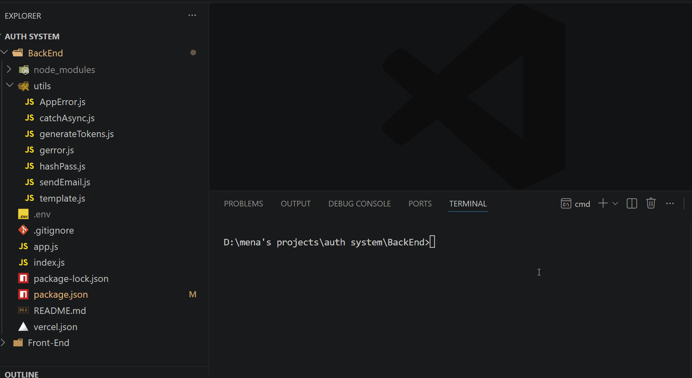
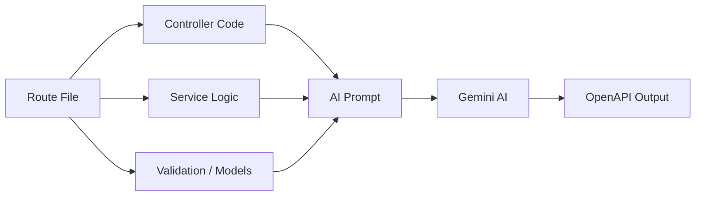
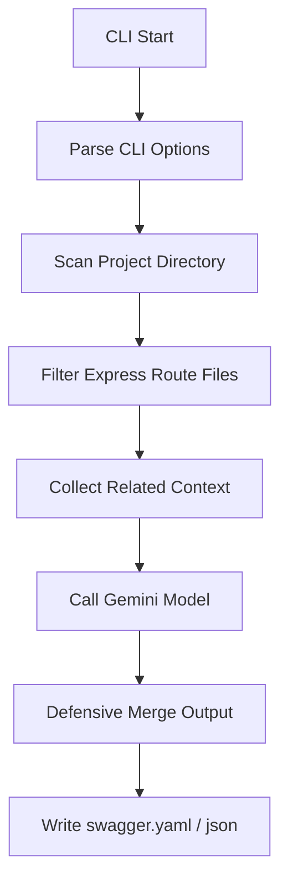

# DocuMind

<p align="center">
  
</p>

[](https://www.npmjs.com/package/@menaemad/documind) [](https://github.com/mena-emad/DocuMind) [](./LICENSE) [](https://www.typescriptlang.org/)

> AI-Powered Swagger/OpenAPI Documentation Generator for Express.js projects with intelligent context stitching.

## 🚀 Why DocuMind?

DocuMind is designed to fix the common problem of shallow or empty generated API docs.
Instead of only parsing route definitions, it intelligently collects surrounding business logic so Gemini understands each endpoint in context.

- Extracts routes, controllers, services, models, and validations
- Encourages deep summaries and descriptions from Gemini
- Prevents empty `paths` and weak documentation
- Keeps generated output aligned with your implementation

## 🎯 Showcase

### Input
A simple Express route plus related service and validation code.

```ts
// src/routes/auth.ts
router.post('/login', authController.login);
```

### Output

```yaml
openapi: 3.0.0
info:
  title: DocuMind Generated API
  version: 1.0.0
  description: Automated OpenAPI documentation generated by DocuMind AI.
paths:
  /login:
    post:
      tags:
        - Auth
      summary: Authenticate user and issue a JWT token.
      description: |
        Verifies credentials against the hashed user password, checks authorization
        roles, signs a JWT token, and returns a session payload.
      requestBody:
        required: true
        content:
          application/json:
            schema:
              $ref: '#/components/schemas/LoginRequest'
      responses:
        '200':
          description: User authenticated successfully.
components:
  schemas:
    LoginRequest:
      type: object
      properties:
        email:
          type: string
          format: email
        password:
          type: string
```

## 🧠 How it Works

### Context Stitching
DocuMind attaches nearby compute context to route files so Gemini sees the full backend flow.



### Generation Flow



## ✨ Key Features

- **Smart File Scanning**: finds Express route files across the project.
- **Context Stitching**: includes controllers, services, models, and validation code.
- **Defensive Merging**: merges AI-generated `paths` and `schemas` safely.
- **Rich Descriptions**: forces Gemini to explain workflows like hashing, JWT creation, roles, and errors.
- **Interactive CLI**: animated progress using `ora`.

## 🧰 Tech Stack

- Node.js (>= 18.0.0)
- TypeScript
- Google Gen AI SDK (`@google/genai`)
- Commander.js
- Ora
- Dotenv
- yaml

## 📥 Installation

### Global

```bash
npm install -g @mena-emad/documind
```

### Local

```bash
git clone https://github.com/mena-emad/DocuMind.git
cd DocuMind
npm install
npm run build
```

Run in development mode:

```bash
npm run dev
```

Run locally:

```bash
npx @mena-emad/documind
```

## 🔧 Environment Variables

DocuMind reads the Gemini API key from `.env`:

```env
DOCUMIND_API_KEY=your_gemini_api_key_here
```

Or pass the key directly using `-k`.

## ▶️ Usage

```bash
documind [options]
```

### CLI Options

| Option | Description | Default |
|---|---|---|
| `-k, --key <api-key>` | Gemini API Key | `DOCUMIND_API_KEY` from `.env` |
| `-d, --dir [directory]` | Directory to scan | `./` |
| `-o, --output [file-name]` | Output filename | `swagger.yaml` |
| `--title [title]` | OpenAPI `info.title` | auto-generated |
| `--api-version [version]` | OpenAPI `info.version` | auto-generated |
| `--desc [description]` | OpenAPI `info.description` | auto-generated |
| `-v, --version` | Show CLI version | - |

### Examples

Generate default output:

```bash
documind
```

Generate docs for a custom source directory:

```bash
documind -d ./src -o api-docs.yaml
```

Use the API key directly:

```bash
documind -k sk-xxxxxxxxxxxxxxxxxxxxxxxxxxxxxxxx
```

Provide OpenAPI metadata:

```bash
documind --title "My App API" --api-version "2.0.0" --desc "AI-generated Swagger docs from Express source code."
```

## 🔍 How DocuMind Processes Code

1. **Scan files**
   - Recursively collect `.js` and `.ts` files.
2. **Filter Express routes**
   - Detect route patterns and Express router usage.
3. **Gather related context**
   - Add matching service, controller, model, and validation files.
4. **Ask Gemini**
   - Send a prompt that demands valid OpenAPI JSON and rich documentation.
5. **Merge outputs defensively**
   - Combine returned `paths` and `components` while handling missing or malformed sections.
6. **Write output**
   - Save YAML or JSON based on the requested filename.

## 👨‍💻 About the Author

Built by **Mena Emad Sawares**.

- Website: [https://menaemad.vercel.app/](https://menaemad.vercel.app/)
- GitHub: [https://github.com/mena-emad](https://github.com/mena-emad)
- Email: [menaemad6543@gmail.com](mailto:menaemad6543@gmail.com)

## 📜 License

DocuMind is released under the **MIT License**.
